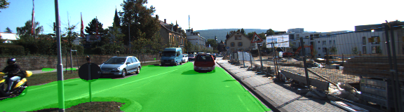
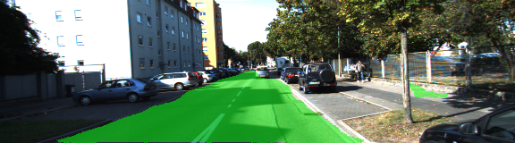
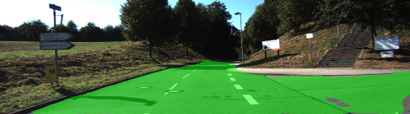
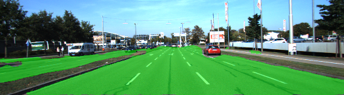
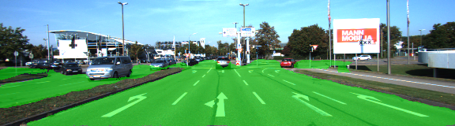
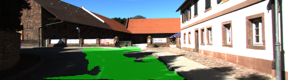

# Semantic Segmentation Project (Advanced Deep Learning)

## target

build a fully convolutional neural network (FCN) based on the VGG-16 image classifier architecture to segment drivable road area from car front-camera image. (experiments done on the KITTTI dataset)

##  architecture

A pre-trained vgg-16 is adapted in architecture to be a FCN network, by transform fully-connected layer to be convolutional and adding deconvulutional layers and skip connections.
In detail, 
1. the convolved vgg layer 7 is upsampled and added to convolved vgg layer 4, resulting into  layer A;
2. layer A is added to convolved vgg layer 3, resulting into layer B;
3. layer B is upsampled to be the final output -- layer C.
 
Inspired by the filter number of the original vgg, in our net, we don't need huge amount of filters to save semantic information, but only small amount of filters to refer a pixel is drivable road or not. 
In our net, 
1. layer A has 2\*16 feature maps (due to 2 \*16 filters in convolution); 
2. layers B 2\*8 feature maps;
3.  layer C 2\*4 feature maps;
4.  layer C 2 feature maps (which is segmentation map).


## training parameters

  - keep_prob: 0.5
  - learning_rate: 1e-3
  - epochs: 30
  - batch_size: 16
   - loss function: cross-entropy
   - error optimizer: Adam

## Results

Steadily, the model loss (averaged over a batch) shrinks over time. 
Epoch 1, batch 1, 0.696
Epoch 2, batch 1, 0.266
Epoch 3, batch 1, 0.248
Epoch 4, batch 1, 0.152
Epoch 5, batch 1, 0.153
...
Epoch 10, batch 1, 0.096
...
Epoch 20, batch 1,0.035
...
Epoch 30, batch 1, 0.023


## success and failure cases

Segmentation results is acceptable. See the below working cases, where predicted drivable road pixels are marked in transparent green. 








In a few of pixels, due to the heavy shallow, the net fails to predict road in shallow as positive area.



---

## *The following is from the original Udacity repository README*


# Semantic Segmentation
### Introduction
In this project, you'll label the pixels of a road in images using a Fully Convolutional Network (FCN).

### Setup
##### Frameworks and Packages
Make sure you have the following is installed:
 - [Python 3](https://www.python.org/)
 - [TensorFlow](https://www.tensorflow.org/)
 - [NumPy](http://www.numpy.org/)
 - [SciPy](https://www.scipy.org/)
##### Dataset
Download the [Kitti Road dataset](http://www.cvlibs.net/datasets/kitti/eval_road.php) from [here](http://www.cvlibs.net/download.php?file=data_road.zip).  Extract the dataset in the `data` folder.  This will create the folder `data_road` with all the training a test images.

### Start
##### Implement
Implement the code in the `main.py` module indicated by the "TODO" comments.
The comments indicated with "OPTIONAL" tag are not required to complete.
##### Run
Run the following command to run the project:
```
python main.py
```
**Note** If running this in Jupyter Notebook system messages, such as those regarding test status, may appear in the terminal rather than the notebook.

### Submission
1. Ensure you've passed all the unit tests.
2. Ensure you pass all points on [the rubric](https://review.udacity.com/#!/rubrics/989/view).
3. Submit the following in a zip file.
 - `helper.py`
 - `main.py`
 - `project_tests.py`
 - Newest inference images from `runs` folder  (**all images from the most recent run**)
 
 ## How to write a README
A well written README file can enhance your project and portfolio.  Develop your abilities to create professional README files by completing [this free course](https://www.udacity.com/course/writing-readmes--ud777).
